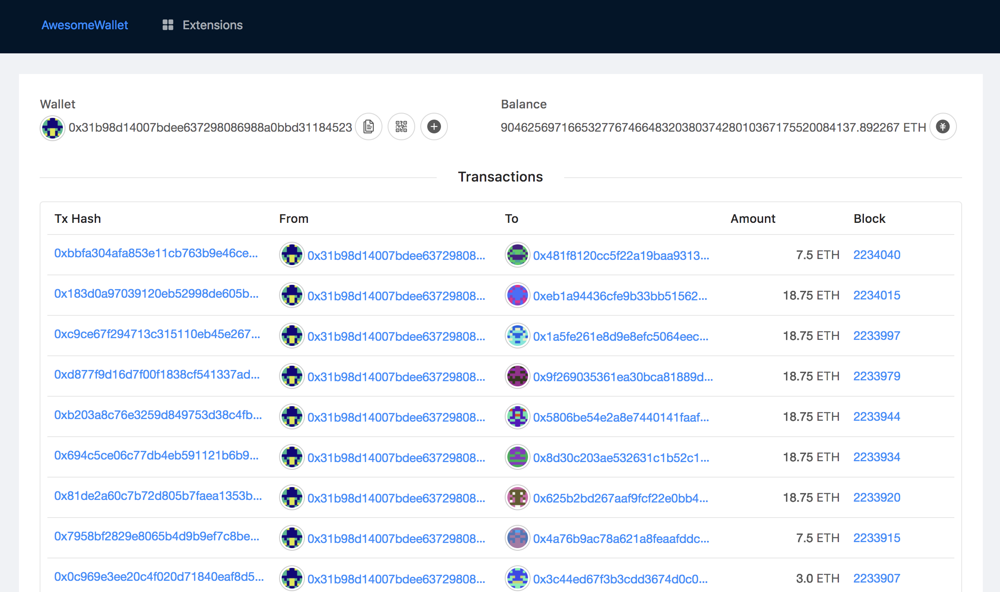
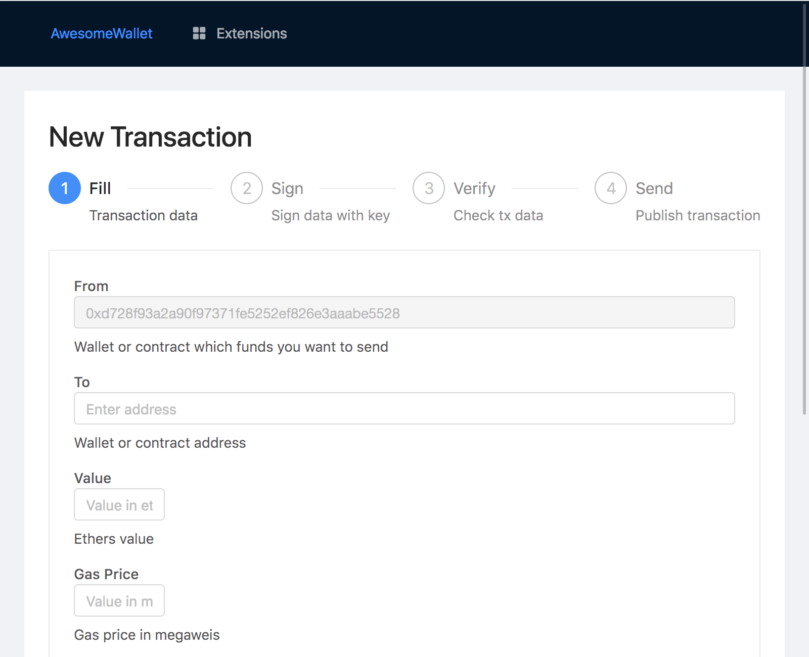
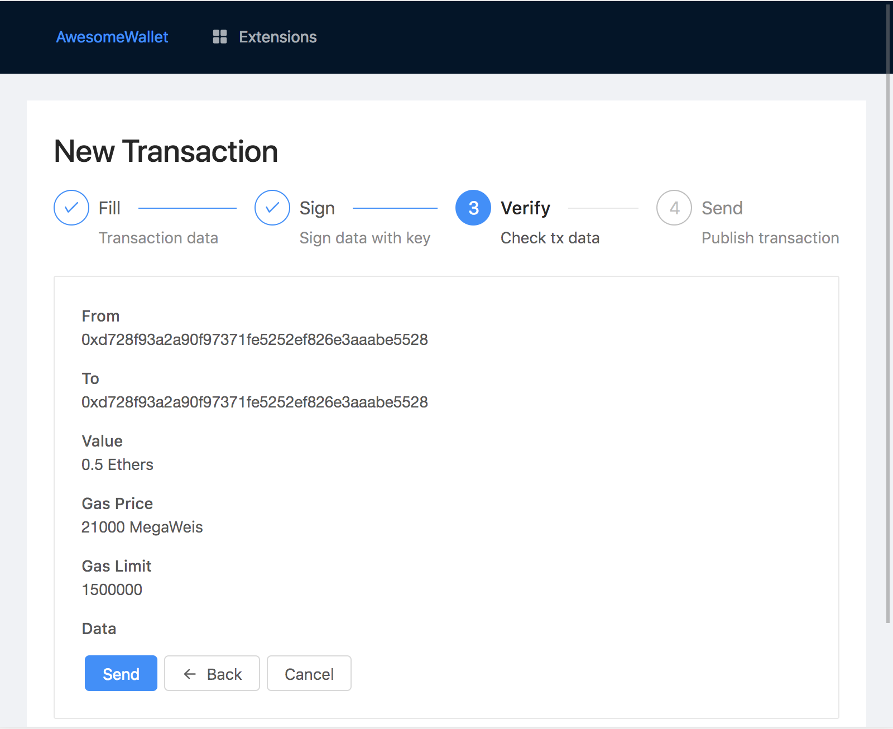
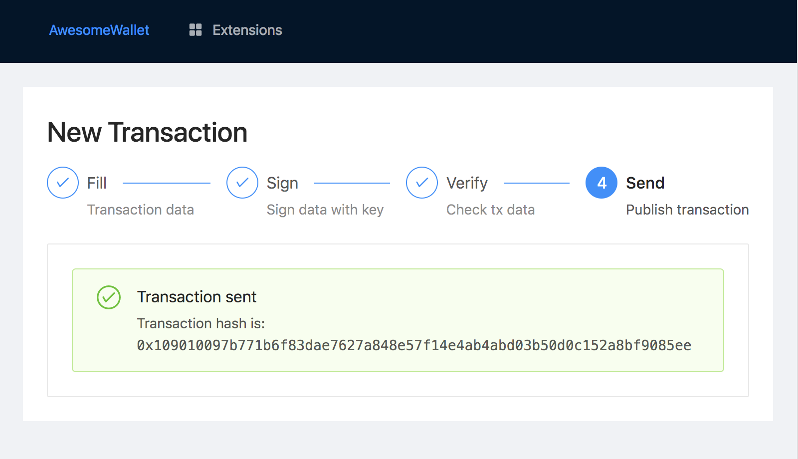
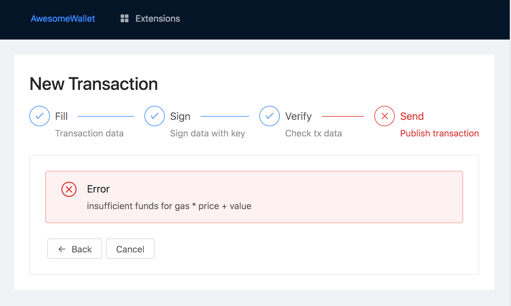

# Awesome Crypto Wallet

Awesome wallet is a single file Ethereum wallet. It's presented with one
`index.html` file containing everything you need to create transactions, view
account history, run dapp extensions, etc.

## Transaction Creation

1. Fill tx form:
  
2. Verify transaction values:
  
3. Transaction sending succeeded:
  
4. Or failed:
  

### License

MIT.
